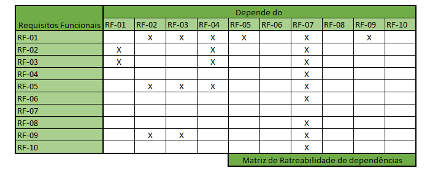
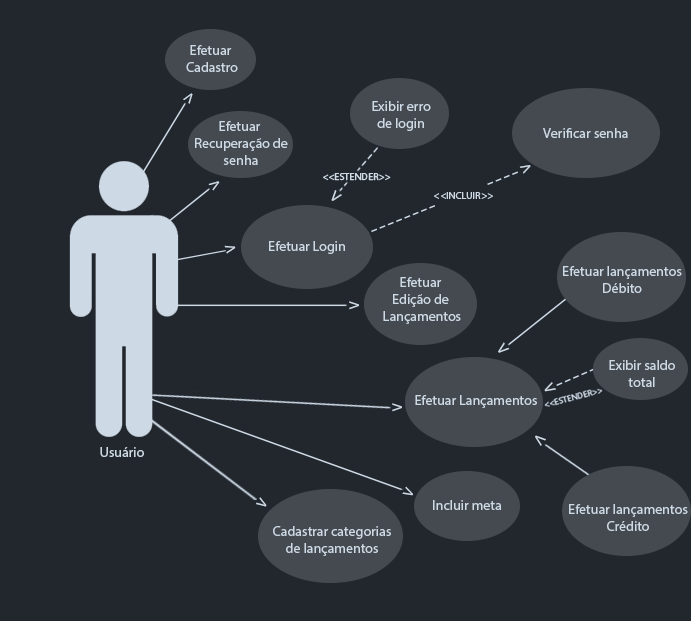
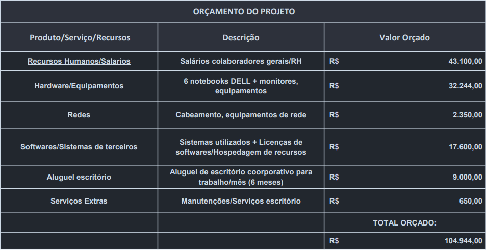

# Especificações do Projeto

Pré-requisitos: <a href="1-Documentação de Contexto.md"> Documentação de Contexto</a>

A definição do problema e os pontos mais relevantes a serem tratados neste projeto foram adquiridos com a participação dos usuários em um trabalho de imersão feita pelos membros da equipe a partir de conversas e entrevistas com potenciais usuários (amigos, familiares, colegas de trabalho). Os dados nesse processo foram consolidados na forma de histórias de usuários.

## Personas

Demétrio Souza tem 19 anos, é estudante de Sistemas da informação e estagiário com a remuneração de R$ 1.620,00. Pensa em se programar para comprar um veículo em breve e percebeu que controlar seus gastos de cabeça não é eficaz. Atualmente está frustrado com o descontrole das suas despesas e com a má distribuição de sua renda.

Rosilene Fernandes tem 22 anos, é arquiteta recém-formada e trainee de Arquitetura com a remuneração de R$ 2.591,00. Rosilene quer controlar seus gastos com cartão de crédito e se programar para pagar sua pós graduação. Atualmente está frustrada pois precisou pagar o mínimo em sua fatura do cartão de crédito.

Samuel Vieira tem 17 anos, é jovem aprendiz e recebe R$ 653,00. Suas motivações são: juntar dinheiro, entender melhor sobre gerenciamento de gastos e ter uma melhor visão onde gasta seu dinheiro. Suas frustrações são: sua falta de controle financeiro, dificuldades em alcançar juntar dinheiro para comprar algo que tenha o valor muito maior do que sua remuneração mensal e sua impulsividade com compras.

Beatriz Sampaio tem 18 anos, é atendente de telemarketing home office e tem a remuneração de R$ 1.212,00. Suas motivações são: controlar seus gastos impulsivos com o cartão de crédito e juntar dinheiro. Suas frustrações são: falta de controle financeiro e dificuldade em controlar sua impulsividade de comprar com o cartão de crédito.

João Nascimento tem 23 anos, é técnico em enfermagem e tem a remuneração de R$ 1.874,00. Suas motivações são: não se enrolar com o cartão de crédito, controlar gastos, juntar dinheiro e evitar pagar contas em atraso. Suas frustrações são: não ver seu dinheiro render, vontade incontrolável de comprar, não conseguir pagar uma faculdade de Enfermagem e medo de ter os dados vazados em um sistema de controle financeiro.

## Histórias de Usuários

Com base na análise das personas forma identificadas as seguintes histórias de usuários:

|EU COMO... `PERSONA`| QUERO/PRECISO ... `FUNCIONALIDADE` |PARA ... `MOTIVO/VALOR`                 |
|--------------------|------------------------------------|----------------------------------------|
|Demétrio Souza   | Ter os gastos separados por seções. Ex: delivery, assinaturas           | Pra conseguir distribuir melhor a renda mensal              |
|Demétrio Souza        | Conseguir separar gastos entre débito e crédito                | Pra não ficar confuso entre os gastos do cartão de crédito e o que for no débito |
|Rosilene Fernandes         | Ter a visão do valor que tem guardado                 | Se programar para o futuro  |
|Samuel Vieira         | Ter a possibilidade de visualizar as minhas receitas e débitos do mês                 | Afim de controlar e mensurar meus gastos mês a mês  |
|Beatriz Sampaio         | Ver todos os meus gastos em uma mesma tela com um total                 | Saber o que posso e o que eu não posso gastar  |
|Beatriz Sampaio         | Criar e planejar metas                  | Ser informada periodicamente sobre a situação das metas |
|João Nascimento        | Ter meu próprio usuário para utilizar o sistema                 | Que outras pessoas não vejam meus lançamentos  |

## Requisitos

O escopo funcional do projeto é definido por meio dos requisitos funcionais que descrevem as possibilidades interação dos usuários, bem como os requisitos não funcionais que descrevem os aspectos que o sistema deverá apresentar de maneira geral apresentados a seguir. 

### Requisitos Funcionais

|ID    | Descrição do Requisito  | Prioridade |
|------|-----------------------------------------|----|
|RF-001| A aplicação permite agrupar valores por seções (categorias)  | ALTA | 
|RF-002| A aplicação permite o lançamento de débitos  | ALTA |
|RF-003| A aplicação permite o lançamento de crédito | ALTA |
|RF-004| A aplicação permite datar lançamentos (exemplo: pagamentos ou recebimentos futuros)  | ALTA |
|RF-005| A aplicação permite a visualização de entradas e saídas por mês | MÉDIA |
|RF-006| A aplicação permite a definição de meta  | BAIXA |
|RF-007| A aplicação terá tela de Login e Senha  | ALTA |
|RF-008| A aplicação permite a recuperação de senha do acesso  | BAIXA |
|RF-009| A aplicação permite a edição de lançamentos já realizados  | MÉDIA |
|RF-010| A aplicação permite o logout de usuário | MÉDIA |
|RF-011| A aplicação permite filtrar os lançamentos por mês e ano | MÉDIA |
|RF-012| A aplicação permite a visualização de entradas e saídas por categorias | ALTA |
|RF-013| A aplicação permite a visualização do progresso da meta definida | ALTA |

### Requisitos não Funcionais

|ID     | Descrição do Requisito  |Prioridade |
|-------|-------------------------|----|
|RNF-001| A aplicação deve ser publicada em um ambiente acessível publicamente na Internet (Repl.it, GitHub Pages, Heroku) | ALTA | 
|RNF-002| A aplicação deve ter bom nível de contraste entre os elementos da tela em conformidade |  MÉDIA | 
|RNF-003| A aplicação deve ser compatível principalmente com o sistema Android |  ALTA | 
|RNF-004| A aplicação será modelada usando UML 2.3  |  BAIXA |
|RNF-005| A aplicação deve ter interface responsiva  |  MÉDIA |
|RNF-006| A aplicação deve ter tela inicial |ALTA|
|RNF-007| A aplicação deve ter tela de recuperar a senha |BAIXA|
|RNF-008| A aplicação deve permitir o acesso apenas de usuários cadastrados |ALTA|

### Regras de negócio
|ID     | Descrição da regra  |Prioridade |
|-------|-------------------------|----|
|RN-001| O sistema deve ser utilizado por pessoas econômicamente ativas maiores de 16 anos | ALTA | 

## Restrições

O projeto está restrito pelos itens apresentados na tabela a seguir.

|ID| Restrição                                             |
|--|-------------------------------------------------------|
|01| O projeto deverá ser entregue no final do semestre letivo, não podendo extrapolar a data de 23/06/2023 |
|02| O aplicativo deve se restringir às tecnologias básicas de desenvolvimento mobile React Native e banco de dados |
|03| A equipe não pode subcontratar o desenvolvimento do trabalho        |
|04| A equipe usará o modelo Kanban para o gerenciamento do projeto      |
|05| O sistema permitirá o cadastro de pessoas maiores de 16 anos        |

## Matriz de Ratreabilidade

## Diagrama de Casos de Uso

O diagrama contempla as principais ligações previstas entre casos de uso e atores e permite detalhar os Requisitos Funcionais identificados na etapa de elicidação. Lembrando que  não se utiliza diagramas de caso de uso para requisitos não-funcionais. 

Como atores é importante a identificação dos grupos de todos os envolvidos que interagem com o sistema, principalmente outros sistemas ou sensores. Eles são representados graficamente por bonecos-palito e serão nomeados pelos papéis nas interações nas quais estão envolvidos (ex. Cliente, Administrador).

Em relação aos casos de uso, eles devem representar as interações ou transações dos atores com o sistema. Cada tipo possível é representada por uma elipse nomeada e os relacionamentos são indicados por linhas que possuem setas nos casos em que se indica a origem da interação. Os nomes dos casos de uso representam verbos no infinitivo associados aos objetos com os quais se relacionam os verbos (ex. Cadastrar usuário, Visualizar relatório). Os tipos de relacionamentos mais comuns são associações entre atores e casos de uso, generalizações entre atores e entre casos de uso, inclusões e extensões entre casos de uso.

## Organograma da Equipe

O organograma foi desenvolvido conforme metodologia ágil Scrum, com a organização sendo composta pelo  Business Owner, Stakeholders, Product Owner, Scrum Master e desenvolvedores.

## Cronograma do Projeto

O cronograma do projeto foi desenvolvido no software MS Project, seguindo as diretrizes de Gerenciamento de Cronograma do PMBOK. Primeiro foi definida a Estrutura Analíta de Projeto (EAP), onde o projeto foi dividido em 5 tarefas e suas subsequentes subtarefas, em seguida foi definido o sequenciamento das atividades e suas durações, seguindo a técnica PERT/CPM. O software calculou automaticamente as folgas e caminho crítico do projeto. O cronograma completo pode ser verficado na imagem abaixo:

## Orçamento do Projeto

O orçamento do projeto foi definido realizando a pesquisa pelos materiais necessários para a conclusão do projeto tendo em vista o prazo de entrega, quantidade de membros da equipe e horas estipuladas conforme seção anterior.

## Modelagem do Processo de Negócio (BPMN)

## Indicadores de Desempenho

Indicadores de desempenho são medidas calculadas e compostas por métricas, geralmente ao final de cada processo do projeto. Entre os papéis de um indicador estão: transmitir as necessidades e expectativas dos clientes; viabilizar o desdobramento das metas do negócio; dar suporte à análise crítica dos resultados do negócio, às tomadas de decisão e ao novo planejamento; contribuir para a melhoria dos proceso e produtos.

Para construir um indicador é necessário:

- Nomear o indicador;
- Definir seu objetivo;
- Definir unidade de medida;
- Estabelecer periodicidade de cálculo;
- Indicar responsável pela geração e divulgação;
- Definir fórmula de cálculo;
- Indicar seu intervalo de validade;
- Apontar onde e como as variáveis serão capturadas (fonte de dados);
- Definir usuários.

Para este projeto foram definidos 5 indicadores de desempenho, listados abaixo conforme métricas descritas anteriormente:

|  | INDICADOR   |  OBJETIVO   |  UNIDADE | PERIODICIDADE | RESPONSÁVEL |  FÓRMULA | INTERVALO DE VALIDADE | VARIÁVEIS |
|--|-------------|-------------|----------|---------------|-------------|----------|-----------------------|-----------|
|01| Número de Downloads do Aplicativo na App Store | Meta primária de 1.000 downloads/mês | downloads/mês | avaliação mensal | Project Manager | downloads/mês | ideal = >1000 | downloads e tempo|
|02| Avaliações na App Store | Manter médias das avaliações acima de 4 | % de avaliações positivas | mensal | Project Manager | 90% das avaliações acima de 4,5 | ideal = superior a 4,5 | avaliações positivas por mês |
|03| Quantidade de usuários cadastrados | ter pelo menos 600 cadastros/mês | cadastros/mês | mensal | Equipe de Desenvolvimento | cadastros/mês | ideal = acima de 600 cadastros/mês | cadastros e tempo |
|04| Tempo de uso do sistema por usuário | aumentar o tempo de uso por usuário a pelo meno 20min/sem | min/semana | semanal | Equipe de Desenvolvimento | tempo de uso por semana | ideal = acima de 20min por semana | tempo de uso semanal |
|05| Usuários ativos | garantir que usuários estejam ativos pelo menos 3 dias na semana | dias ativos por semana| semana | Equipe de Desenvolvimento | dias ativos por semana | ideal = acima de 3 dias | dias ativos |

