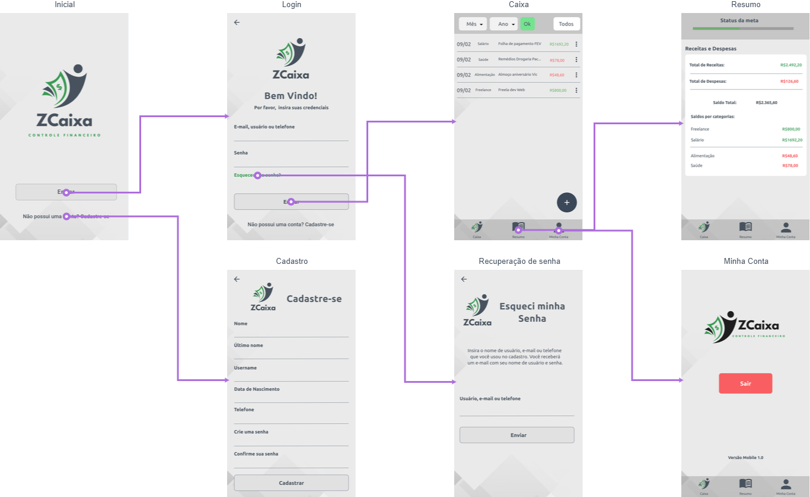
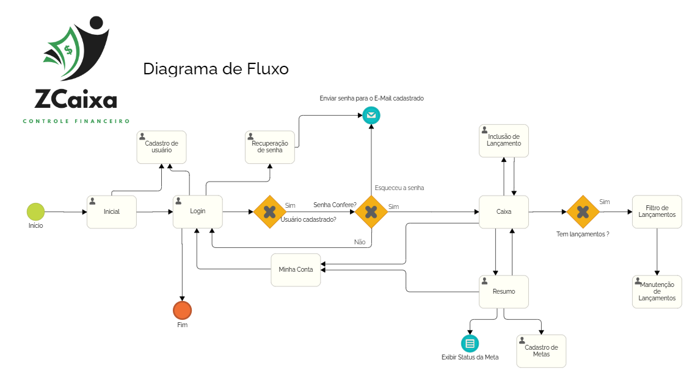
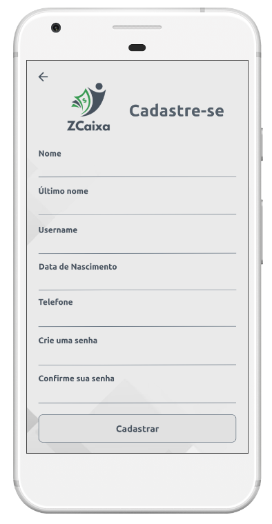
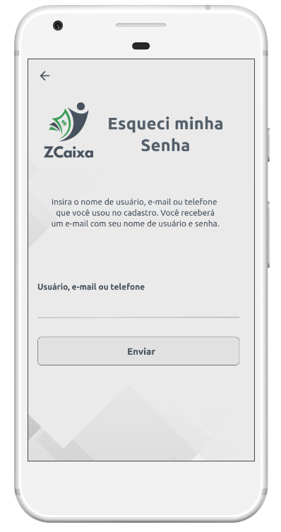
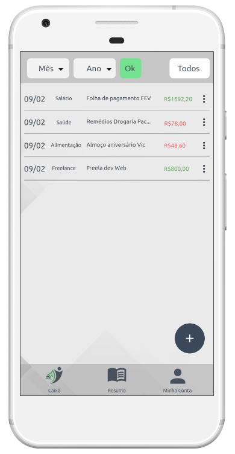
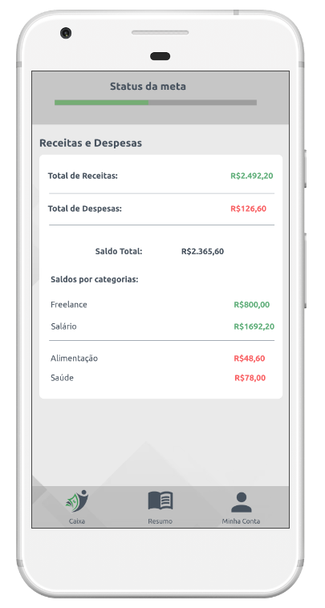
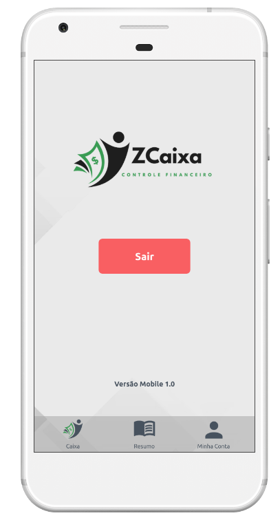

# Projeto de Interface

Pré-requisitos: <a href="2-Especificação do Projeto.md"> Documentação de Especificação</a>

Visão geral da interação do usuário pelas telas do sistema e protótipo interativo das telas com as funcionalidades que fazem parte do sistema (wireframes).

*Mapa de Fluxo:*

[Link Wireframe interativo (MarvelAPP)](https://marvelapp.com/prototype/6a20jd5)

Estabelecendo foco em questões como agilidade e usabilidade. O projeto tem identidade visual padronizada em todas as telas e são projetadas para funcionamento em dispositivos Android.

 Atendendo os requisitos RF-007, RF-008 a primeira tela apresentada ao usuário é referente ao acesso ao caixa. Onde é solicitado as credenciais para quem já possui um cadastro, a opção para recuperação de senha e opção para cadastramento.
 Na area logada é apresentado um menu inferior para navegação contendo três opções (Caixa, Resumo e Minha conta).
 
 **Caixa:** Sendo a primeira tela de exibição ao realizar o acesso, é apresentado ao usuário os lançamentos do mês e ano vigente (ao acesso), sendo possível a alteração do filtro por mês e ano na parte superior. Em cada lançamento tem um botão de menu que exibe as opções de alterar e deletar um lançamento. Na listagem, possui um botão fixo com símbolo "+" que exibe ao usuário as opções para adicionar um lançamento ou definir/alterar o valor da meta (Requisitos atendidos: RF-002, RF-003, RF-004, RF-006, RF-009 e RF-011) 
 
 **Resumo:** Tela onde é exibida o progresso da meta definida pelo usuário por uma barra de progresso (quanto mais cheia, mais perto da meta estabelecida), o saldo da total da carteira, o saldo de entradas e saídas sumarizadas assim como o valor total referente a cada categoria (valores são atualizados conforme filtro na página caixa). (Requisitos atendidos: RF-001, RF-005, RF-012 e RF-013).

**Minha Conta:**

Tela onde é exibida a versão do APP e botão para realizar o logout do usuário atual da plataforma.

Na seção Wireframes abaixo consta as imagens da tela assim como seu navegável.

## Diagrama de Fluxo
O diagrama apresenta o estudo do fluxo de interação do usuário com o sistema interativo. Isso permite que o design das interações seja bem planejado e gere impacto na qualidade no design do wireframe interativo.

## Wireframes
Protótipos usados em design de interface desenvolvidos no MarvelApp.

[Link Wireframe interativo (MarvelAPP)](https://marvelapp.com/prototype/6a20jd5)

**Início**

**Login**

**Cadastro**

**Recuperação de senha**

**Caixa**

**Resumo**

**Minha Conta**

