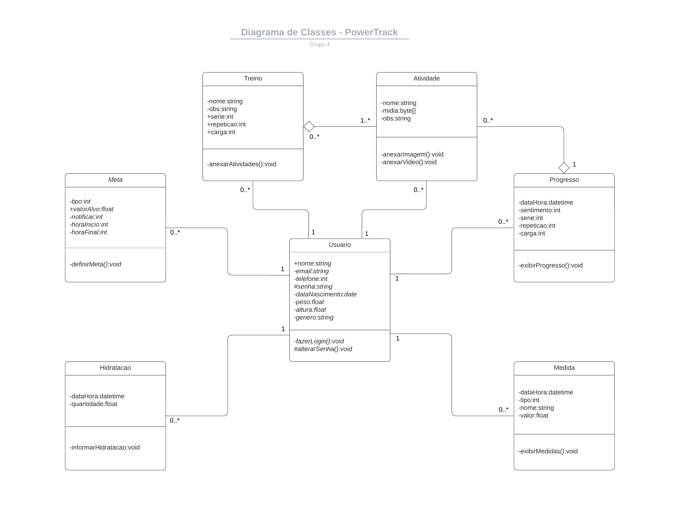
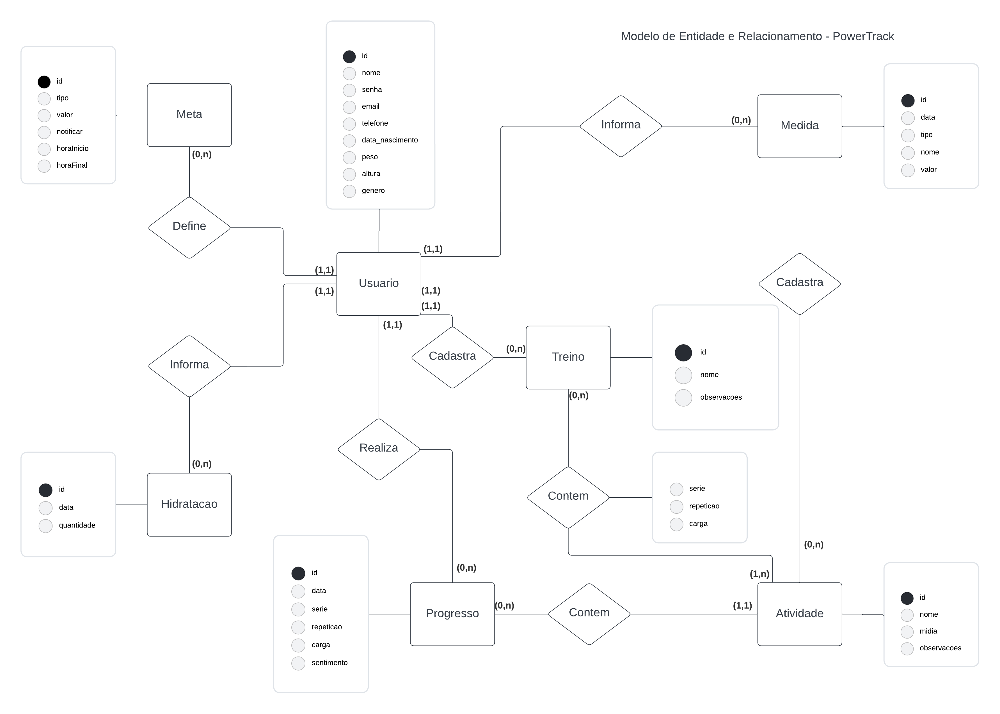
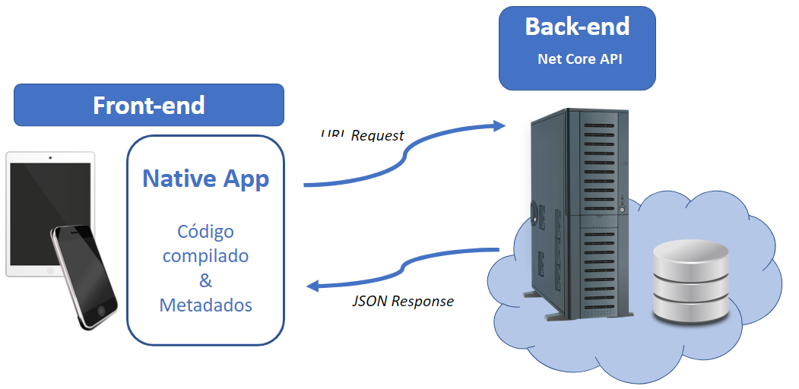

# Arquitetura da Solução

Pré-requisitos: <a href="3-Projeto de Interface.md"> Projeto de Interface</a>

Definição de como o software é estruturado em termos dos componentes que fazem parte da solução e do ambiente de hospedagem da aplicação.

## Diagrama de Classes
O diagrama de classes oferece uma representação gráfica da estrutura do software, destacando a interconexão entre as diversas classes que o compõem. Essas classes atuam como modelos fundamentais para a criação dos objetos que serão instanciados e executados em memória, facilitando a compreensão da arquitetura e das relações entre os componentes do sistema.

## Modelo ER (Projeto Conceitual)
O Modelo ER (Entidade-Relacionamento) utiliza um diagrama para ilustrar de forma clara como as entidades, que representam objetos ou conceitos relevantes, se interrelacionam dentro da aplicação interativa. Este modelo facilita a visualização das conexões e interações entre os diferentes componentes do sistema, proporcionando uma compreensão abrangente da estrutura de dados subjacente.

##  Esquema Relacional - Projeto da Base de Dados 
O Esquema Relacional corresponde à representação dos dados em tabelas juntamente com as restrições de integridade e chave primária.

## Modelo Físico

Arquivo banco.sql contendo os scripts de criação das tabelas do banco de dados que consta na pasta src\bd

[Arquivo banco.sql](../src/bd/banco.sql)

## Tecnologias Utilizadas

As ferramentas empregadas no projeto são:

- Editor de código : Visual Studio Code;
- Emulador da aplicação: Android Studio, NPM;
- Ferramentas de comunicação: Whatsapp, Teams;
- Gerencimaneto do projeto: GitHub Desktop, GitHub Projects e MS Project;
- Ferramentas de desenho de tela (_wireframing_): MarvelAPP, Heflo;
- Ferramentas para diagramas (conceitual e lógico): Diagrams.net, Astah, Lucid Charts, BRMW.

O editor de código foi escolhido pelo grupo pois é o mais prático e acessível para os integrantes, além de facilitar a alternação de quem está editando o código e salvando diretamente no reposítorio através do GitHub Desktop. Tem um bom dicionário de erros no código e permite acompanhar alterações em tempo real através do emulador do android studio.

## Hospedagem

A hospedagem do back-end é mantida no Azure.
A hospedagem do banco de dados é mantida em um servidor privado. 
A aplicação ficará disponibilizada no Google Play(Android). 

Para a versão web, o back-end é hospedado de forma confiável também na infraestrutura do Azure. O banco de dados, por outro lado, é mantido em um servidor privado, garantindo a segurança dos dados. A aplicação estará acessível diretamente pelo navegador, proporcionando uma experiência online fluida e intuitiva para os usuários.

## Qualidade de Software
Sabemos que a qualidade de software é a medida em que um software atende aos requisitos do usuário e aos padrões de qualidade estabelecidos. Isso inclui a capacidade do software de funcionar corretamente, de ser fácil de usar e de ser seguro e confiável. A qualidade de software também pode ser medida pela eficiência e eficácia do software, como o seu desempenho por exemplo.

Sendo assim o aplicativo de controle financeiro e educação financeira ZCaixa é um exemplo de software de qualidade. Ele é desenvolvido para ajudar os usuários a controlar suas finanças, gerenciar seus gastos e economizar dinheiro. O aplicativo possui uma interface intuitiva e fácil de usar, o que o torna acessível para usuários de todos os níveis de habilidade.

Além disso, o ZCaixa é uma aplicação de alta segurança e perfomance, voltada para o uso do controle financeiro.
O ZCaixa também inclui recursos de educação financeira, sobre dinheiro e gerenciar suas finanças. Isso torna o aplicativo uma ferramenta valiosa para quem deseja melhorar sua saúde financeira e alcançar seus objetivos financeiros.

Em resumo, o ZCaixa é um exemplo de software de qualidade que oferece aos usuários um conjunto abrangente de recursos para gerenciar suas finanças e melhorar sua educação financeira. Com sua interface intuitiva e recursos de segurança avançados, o aplicativo é a escolha perfeita para quem deseja controlar suas finanças com eficiência e confiabilidade.

### Funcionalidade:
- Ajuda os usuários a controlar suas finanças.
- Gerencia gastos e ajuda a economizar dinheiro.
- Oferece recursos de educação financeira.

### Confiabilidade:
- É seguro e confiável.
- Possui autenticação(Login/Cadastro) de usuários.
- Garante a proteção das informações financeiras dos usuários.

### Portabilidade:
- Disponível como aplicativo móvel.
- Pode ser usado em diferentes dispositivos móveis (tablets/smartphones).
- Tem suporte a diferentes sistemas operacionais móveis.

### Manutenção:
- Possui atualizações regulares para melhorias e correções;
- Oferece suporte técnico aos usuários;
- Mantém um registro de erros e bugs para solucioná-los de forma eficaz.

