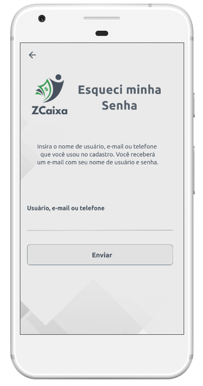
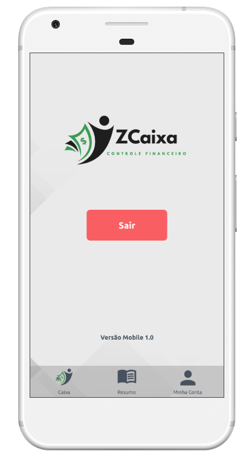

# Template Padrão da Aplicação

Pré-requisitos: <a href="2-Especificação do Projeto.md"> Especificação do Projeto</a>, <a href="3-Projeto de Interface.md"> Projeto de Interface</a>, <a href="4-Metodologia.md"> Metodologia</a>

O Template Padráo pode ser entendido como o Layout padrão da aplicação que será utilizado em todas as páginas com a definição de identidade visual, aspectos de responsividade e iconografia. O Template foi desenvolvido através do MarvelApp e pode ser visualizado no link e imagens abaixo:

[Link Wireframe interativo (MarvelAPP)](https://marvelapp.com/prototype/6a20jd5)

**Início**

**Login**

**Cadastro**

**Recuperação de senha**

**Caixa**

**Resumo**

**Minha Conta**

