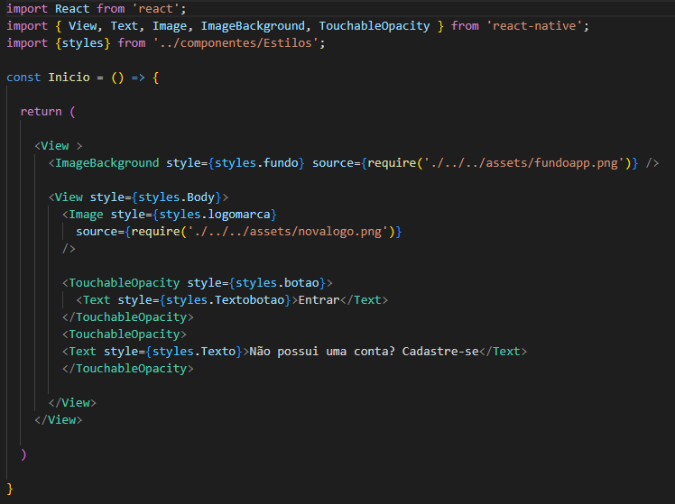
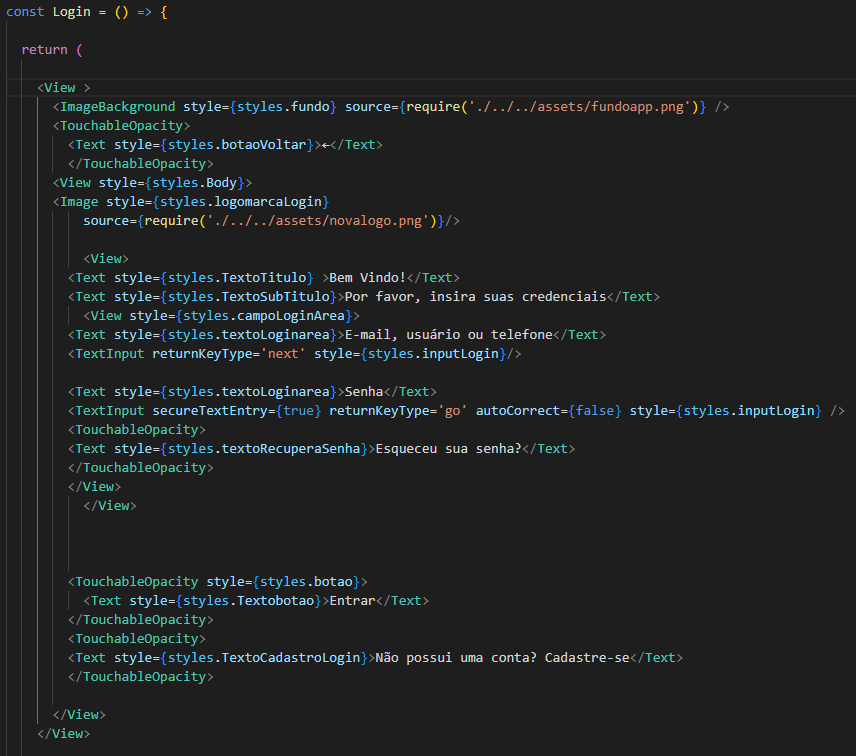
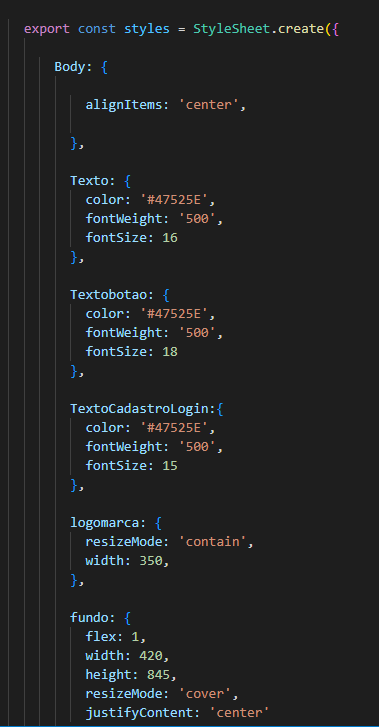

# Programação de Funcionalidades

Pré-requisitos: <a href="2-Especificação do Projeto.md"> Especificação do Projeto</a>, <a href="3-Projeto de Interface.md"> Projeto de Interface</a>, <a href="4-Metodologia.md"> Metodologia</a>, <a href="3-Projeto de Interface.md"> Projeto de Interface</a>, <a href="5-Arquitetura da Solução.md"> Arquitetura da Solução</a>
 
## Artefatos

No projeto nominado "ZCaixa Mobile" no Visual Studio Code,  seguimos realizando o desenvolvimento do projeto por meio Local (na própria máquina). Ao finalizar as alterações necessárias e realizando commit para o presente respositório, outro membro do grupo pode importar as atualizações por meio do GitHub Desktop e dar andamento em seu VSCode local. 

Iniciando o a atendimento aos requisitos RF-007	e RF-008, implementamos o front-end das telas onde as funcionalidades de login, cadastro e recuperação de senha estarão associadas. Os arquivos (ou páginas da aplicação) Inicio.tsx e Login.tsx utilizam a variável "styles" localizada no arquivo Estilos.tsx onde importam as propriedades de estilização para os objetos das páginas (textos, botões, tamanhos, espaçamentos...). 
Abaixo a print de parte dos códigos:

**Inicio.tsx**
> 

**Login.tsx**
> 

**Variável styles**
> 
